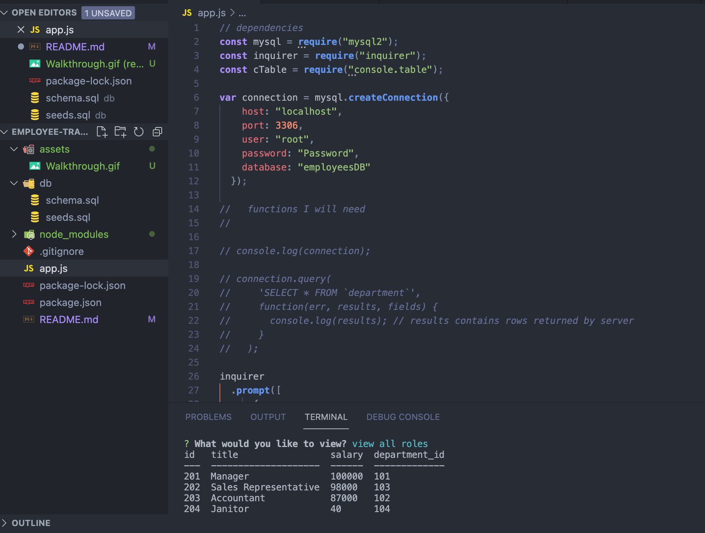

# employee-tracker

## link

- [Live Link to Demo](https://drive.google.com/file/d/1L8Ps0I5Brmn0CyA_RLxR-rKXBv-TCm11/view)

## Description

This application uses SQL to connect a database that tracks employee information. Tables are shown in the terminal when the user selects specific prompts.

## Installation
Run:

                npm i

## Repository

- [Project Repo](https://github.com/fausnightm/employee-tracker)
